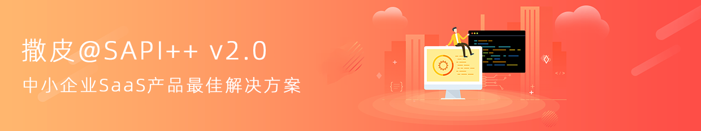

## SAPI++是什么

SAPI++ 是多应用、多租户、多终端的SaaS平台开发框架。基于ThinkPHP6.x的多应用模式开发,开发者不需要二次学习,就可以开发自己的多应用多租户SaaS服务平台，简单好用是SAPI++的特点。

#### 官网与手册

http://www.sapixx.com

####  对你有帮助.感谢动下鼠标点下 star :+1:

#### SAPI++ v2.0 特点

 -  **开箱即用**  分钟快速安装，安装后即可进入开发无需复杂配置。
 -  **应用隔离**  支持分库分表，用户数据安全自助决定。
 -  **方便快捷**  没用VUE框架，免编译，基于原生jQuery并封装统一入口。
 -  **API鉴权**  集成规范的API开发逻辑,符合REST API设计理论，系统集成鉴权机制。
 -  **菜单接入**  接口化菜单接入，可将应用轻松接入任意菜单模块中，无需后台配置。
 -  **精美样式**  针对SAPI++管理端开发独立精美CSSUI样式。
 -  **独立域名**  所有租户支持独立绑定独立域名.例:WEB/H5可绑定独立访问。

#### SAPI++ v2.0 优势

- 接入微信开放平台,SaaS应用(微信小程序)一键授权发布;
- 完善的微信公众号、小程序帐号授权体系,基于API已全部封装,不用二次开发,你只需关注应用功能的开发；
- 支持VUE/React前后端分离,SSR形式和混合开发；
- 支持开发APP（安卓，IOS）、公众号、小程序、H5、PC等独立应用；
- 租户的购买、授权、充值、消费账单管理；
- 支持完善的会员帐号体系,和无限极会员层级管理；
- 租户同时购买授权无数个产品应用

#### 加入讨论

如果在开发进行中,还有一些文档里没有的问题和想法您可以加入QQ群或者微信群和我们交流。

#### 报告 Bug
当你在使用过程中遇到问题，请查阅手册 常见问题 或者在这里提问 [Gitee](https://gitee.com/goodline/sapixx/issues "Gitee"). 如果还是不能解决你的问题，请加入讨论(微信群或QQ群)联系我们。

####  联系我
 

![联系我]

#### 使用须知

- 允许用于学习、毕设等。
- 如需要商业使用请获得商业授权，请自觉遵守使用协议，别给公司带来不必要麻烦。
- 用户可以使用SAPI++框架与开发者基于SAPI++开发的独立应用进行商业行为。

#### 禁止
- gpl-3.0 Licence的约束力仅限SAPI++,不包括基于SAPI++开发的独立应用。
- SAPI++ 框架开放全部源码，但未获商业授权之前你不可以将代码和资源进行任何形式的重新分发、出租、出售、抵押或发放子许可证。
- 基于SAPI++ 开发的任何衍生独立应用(不包括SAPI++引擎本身),所有权归开发者所有,开发者可进行任何形式的商业行为。
- 授权用户将在享有上述条款授予的权力的同时，受到相关的约束和限制。
- 协议许可范围以外的行为，将直接违反本授权协议并构成侵权，我们有权随时终止授权，责令停止损害，并保留追究相关责任的权力。
- 因本协议履行过程中的争议，由布朗斯通科技所在地人民法院审理。